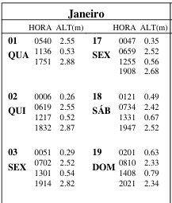

# 🌊 mare-etl

Pipeline em **Node.js** para **extração, normalização, validação e consolidação** de dados oficiais de **tábua de marés** (DHN), com foco no **Terminal Portuário do Pecém**.

O projeto transforma PDFs oficiais em **JSON estruturado**, organizado por **ano e mês**, validável e pronto para uso em aplicações, APIs ou análises.

---

## 🎯 Objetivo do Projeto

Este projeto foi criado para:

* Automatizar a conversão de PDFs oficiais em dados estruturados
* Garantir **fidelidade total aos dados da DHN**
* Facilitar reutilização dos dados em sistemas portuários, APIs e análises
* Servir como base para ETL de dados oceanográficos

---

## 🚀 Funcionalidades

* 📄 Extração de dados de maré a partir de **PDF oficial**
* 🔄 Conversão estruturada para **JSON mensal**
* 📦 Consolidação de todos os meses em um JSON anual
* ✅ Validação detalhada entre JSON oficial e JSON de terceiros
* 🧠 Relatórios claros de inconsistências (data, hora, altura)
* 📁 Organização escalável por **ano**
* ♻️ Reutilizável para qualquer ano (sem código fixo)
---

## 📁 Estrutura do Projeto

```
mare-etl/
├── mares/
│   ├── 2026/
│   │   ├── pdf/
│   │   │   └── pecem-2026.pdf
│   │   ├── oficial/
│   │   │   ├── 2026-01.json
│   │   │   ├── 2026-02.json
│   │   │   └── ...
│   │   └── mare-pecem-2026.json
│   ├── 2027/
│   │   └── ...
│
├── scripts/
│   ├── criar-estrutura-do-ano.js
│   ├── extrair-mare.mjs
│   ├── juntar-mare.mjs
│   └── validar-mare.js
│
├── package.json
└── README.md
```

---

## 📦 Instalação

```bash
git clone https://github.com/liandersonDesen/mare-etl.git
cd mare-etl
npm install
```

---

## 🗂️ 1. Criar estrutura para um novo ano

Cria automaticamente as pastas `mares/<ano>/pdf` e `mares/<ano>/oficial`.

```bash
node scripts/criar-estrutura-do-ano.js 2026
```

Ou via npm:

```bash
npm run criar 2026
```

---

## 📄 2. Adicionar o PDF oficial

Coloque o PDF do ano correspondente em:

```
mares/2026/pdf/pecem-2026.pdf
```

> O nome do arquivo deve seguir o padrão `pecem-<ano>.pdf`.

---

## 🔍 3. Extrair dados do PDF

Gera automaticamente os arquivos mensais:

```bash
npm run extrair 2026
```

Resultado:

```
mares/2026/oficial/
├── 2026-01.json
├── 2026-02.json
└── ...
```

---

## 🧩 4. Juntar todos os meses em um JSON anual

```bash
npm run juntar 2026
```

Resultado:

```
mares/2026/mare-pecem-2026.json
```

---

## ✅ 5. Validar dados

Compara o JSON anual oficial com outro arquivo (ex: extração alternativa).

```bash
npm run estrutura 2026 amigo/mare-pecem-2026.json
```

Saída esperada:

```txt
✅ JSON do amigo está 100% compatível com o oficial
```

Ou lista detalhada de divergências (data, hora ou altura).

---

## 📄 Exemplo real de extração (PDF → JSON)

Abaixo está um exemplo **real** de conversão automática a partir do PDF oficial da DHN (Tábua de Marés – Terminal Portuário do Pecém).

### 📕 Trecho do PDF oficial (Janeiro)



### 📦 JSON gerado automaticamente

```json
[
  {
    "data": "2025-01-01",
    "dados": [
      { "hora": "05:40", "altura": 2.55 },
      { "hora": "11:36", "altura": 0.53 },
      { "hora": "17:51", "altura": 2.88 }
    ]
  },
  {
    "data": "2025-01-02",
    "dados": [
      { "hora": "00:06", "altura": 0.26 },
      { "hora": "06:19", "altura": 2.55 },
      { "hora": "12:17", "altura": 0.52 },
      { "hora": "18:32", "altura": 2.87 }
    ]
  },
  .
  .
  .
  .
]
```

---

## 🛠️ Tecnologias

* Node.js
* pdf-parse
* File System (`fs`)
* Scripts CLI customizados

---

## 📌 Observações

* O código é **agnóstico ao ano** — funciona para qualquer PDF no mesmo padrão
* Nenhum arquivo é sobrescrito sem necessidade
* Estrutura pensada para escalar por décadas de dados

---

## 📄 Licença

MIT

---
## 👨‍💻 Autor
 [LiandersonDesen](https://github.com/LiandersonDesen)

---

Projeto desenvolvido para estudo, validação e engenharia de dados.

Se você trabalha com **dados oficiais, PDFs complexos ou pipelines ETL**, este projeto pode servir como base sólida.
